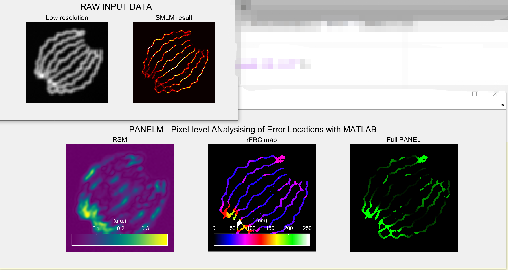

 

 
 

<h1 align="center">PANELM</h1>
<h6 align="right">v0.3.0</h6>
<h5 align="center">Pixel-level ANalysis of Error Locations (or resolution) with Matlab.</h5>

 

  
Pixel-level ANalysis of Error Locations (or resolution) with Matlab is distributed as accompanying software for publication: [Weisong Zhao et al. PANEL: quantitatively mapping reconstruction errors at super-resolution scale by rolling Fourier ring correlation, Nature Methods, X, XXX-XXX (2022)](https://www.nature.com/nmeth/). Please cite PANEL in your publications, if it helps your research.
 
 
 

## PANELM for error mapping

## Declaration
This repository contains the Maltab source code for <b>PANEL</b> .  

If you are not a Matlab user, you can have a try on the imagej version of PANEL: [PANELJ](https://github.com/WeisongZhao/PANELJ).

## Open source [PANELM](https://github.com/WeisongZhao/PANELM)
This software and corresponding methods can only be used for **non-commercial** use, and they are under **Open Data Commons Open Database License v1.0**.

